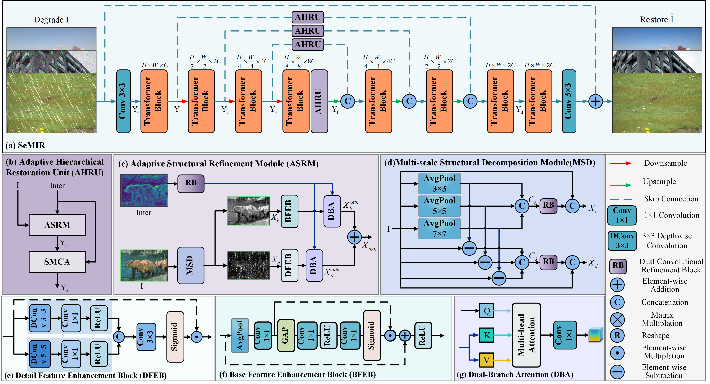

# SeMIR: Adaptive Structural and Semantic Modulation for All-in-One


<hr />

> **Abstract:** *All-in-one image restoration aims to recover high-quality images from various degradation types and severities. Although most studies aim to directly learn an end-to-end mapping from degraded images to clean ones through complex feature extraction modules, they generally overlook a progressive coarse-to-fine restoration strategy, leading to suboptimal recovery of fine image details. To address these limitations, we propose SeMIR, a novel adaptive all-in-one image restoration framework based on structural and semantic modulation. In this paper, in order to fully exploit structural feature modeling and semantic information, we propose an Adaptive Hierarchical Restoration Unit (AHRU), which is designed to enable progressive restoration from coarse-grained structural reconstruction to fine-grained semantic enhancement. Specifically, AHRU consists of two components: 1) Adaptive Structural Refinement Module (ASRM) leverages wavelet-domain decomposition and adaptive sub-band processing to explicitly model image structural features, enabling frequency-aware adaptive restoration. 2) CLIP-Modulated Cross-Attention block (CMCA) introduces cross-modal semantic guidance to enhance the model’s focus on task-relevant features, improving overall performance under diverse degradation conditions. Benefiting from the above key designs, our method not only significantly improves the quality and detail of image restoration but also efficiently handles multiple types of image degradation. Comprehensive experiments on representative types of degradations (including noise, haze, rain, blur, and low-light) demonstrate that our approach achieves state-of-the-art performance in all-in-one image restoration.* 
<hr />

## Model Architecture
 

---

## Python Runtime Environment 

```
python: 3.11.8

pytorch: 2.2.2

numpy: 1.26.4
```

You can set up the environment dependencies by running the command:

```bash
pip install -r requirements.txt
```
---
## Training

After preparing the training data in ```data/``` directory, use 
```
python train.py
```

---

## Testing

After preparing the testing data, place the mode checkpoint file in the ```checkpoint``` directory. 
```
python test.py 
```

---

## Contact

**Acknowledgment:** This code is based on the [PromptIR](https://github.com/va1shn9v/PromptIR) repository. 


---
